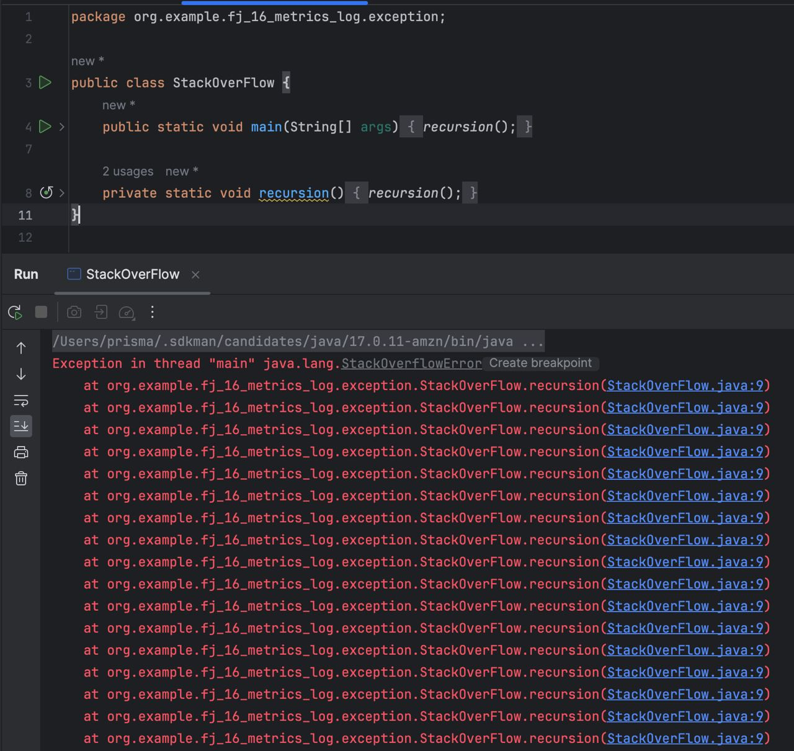

# ДЗ №16

## 1. Поднять локально ELK через compose
### 1.1 Скрины из Kibana с логами
- Приложить скриншоты.

### 1.2 Добавить структурный лог
- Прокинуть любое поле через MDC.
- Приложить скриншоты логов.
  

### 1.3 Построить график в Kibana
- Построить график с количеством запросов.
- Приложить скриншоты.
  

## 2. Подключить метрики к проекту
### 2.1 Подключить Actuator
- Приложить скриншот ответа `.../actuator`.
  

### 2.2 Подключить Prometheus
- Создать пользовательскую метрику.
- Приложить скриншот ответа `/prometheus` с метрикой.

## 3. Разобраться с работой с памятью
### 3.1 Пример для StackOverflow
Привести пример кода.

### 3.2 Пример для OutOfMemory
Привести пример кода.

